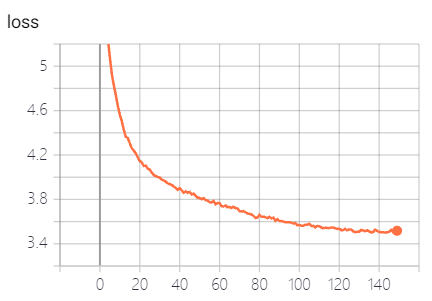

## About this repository  

This repo contains an Pytorch implementation for the ACL 2017 paper *[Get To The Point: Summarization with Pointer-Generator Networks](https://arxiv.org/abs/1704.04368)*. The code framework is based on [TextBox](https://github.com/RUCAIBox/TextBox).

---

## Environment 

- `python >= 3.8.11` 
- `torch >= 1.6.0`

Run `install.sh` to install other requirements.

## Dataset
The processed dataset can be downloaded from [Google Drive](https://drive.google.com/file/d/1jflhxnTcuo74AzD1a2aTPoaw17lUnmuG/view?usp=sharing). Once finished, unzip the datafiles (`train.src`, `train.tgt`, ...) to `./data`. 

An overview of dataset: `train`: 287113 cases, `dev`: 13368 cases, `test`: 11490 cases


## Paramters

```yaml
# overall settings
data_path: 'data/'
checkpoint_dir: 'saved/'
generated_text_dir: 'generated/'
# dataset settings
max_vocab_size: 50000
src_len: 400
tgt_len: 100

# model settngs
decoding_strategy: 'beam_search'
beam_size: 4
is_attention: True
is_pgen: True
is_coverage: True
cov_loss_lambda: 1.0
```
Log file is located in `./log`, more details can be found in [yamls](./yamls).

**Note**: Distributed Data Parallel (DDP) is not supported yet.


## Train & Evaluation

### From scratch run `fire.py`.
```python 
if __name__ == '__main__':
    config = Config(config_dict={'test_only': False,
                                 'load_experiment': None})
    train(config)
```

If you want to resume from a checkpoint, just set the `'load_experiment': './saved/$model_name$.pth'`. Similarly, when `'test_only'` is set to `True`, `'load_experiment'` is required.

## Results

The best model is trained on a TITAN Xp GPU (10GB usage).

### Training loss 
<div align="center"></div> 

### Ablation study
<table align="center">
<thead>
<tr>
<th align="center">Model</th>
<th align="center">Rouge-1</th>
<th align="center">Rouge-2</th>
<th align="center">Rouge-L</th>
</tr>
</thead>
<tbody>
<tr>
<td align="center">Seq2Seq</td>
<td align="center">22.17</td>
<td align="center">7.20</td>
<td align="center">20.97</td>
</tr>
<tr>
<td align="center">Seq2Seq+attn</td>
<td align="center">29.35</td>
<td align="center">12.58</td>
<td align="center">27.38</td>
</tr>
<tr>
<td align="center">Seq2Seq+attn+pgen</td>
<td align="center">36.04</td>
<td align="center">15.87</td>
<td align="center">32.92</td>
</tr>
<tr>
<td align="center"><strong>Seq2Seq+attn+pgen+coverage</strong></td>
<td align="center"><strong>41.52</strong></td>
<td align="center"><strong>19.82</strong></td>
<td align="center"><strong>38.53</strong></td>
</tr>
</tbody>
</table>

**Note**: The architecture of the Seq2Seq model is based on `lstm`, I hope I can replace it with `transformer` in the future.

---
